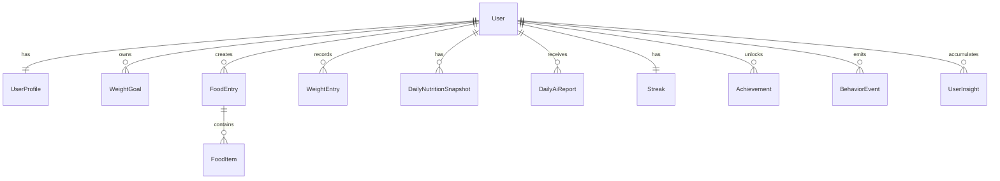

# LeanMate 领域模型设计

## 业务域划分

LeanMate 的核心业务域分为：

- 用户域：账号、档案、减脂目标。
- 饮食域：饮食记录、食物项、识别结果、营养估算。
- 体重域：体重记录、趋势数据。
- 统计域：每日热量、营养、目标完成情况。
- AI 反馈域：AI 日报、周报、月报、建议。
- 留存域：连续记录、成就、里程碑。
- 行为洞察域：行为事件、风险预警、个性化模型。

## 核心实体

### User

用户账号主体。

关键字段：

- id
- phone/email/oauth_id
- nickname
- status
- created_at
- updated_at

### UserProfile

用户身体与活动信息。

关键字段：

- user_id
- gender
- age
- height_cm
- current_weight_kg
- target_weight_kg
- activity_level
- bmi
- bmr_kcal
- daily_calorie_target_kcal

说明：BMI、BMR、推荐热量可以保存为快照，避免后续公式调整影响历史数据解释。

### WeightGoal

用户减脂目标。

关键字段：

- id
- user_id
- start_weight_kg
- target_weight_kg
- target_date
- daily_calorie_target_kcal
- status

### FoodEntry

一次饮食记录，通常对应早餐、午餐、晚餐或加餐中的一次提交。

关键字段：

- id
- user_id
- meal_date
- meal_type
- source_type：photo/text/manual
- raw_text
- image_url
- status：draft/confirmed/deleted
- total_calories_kcal
- total_protein_g
- total_fat_g
- total_carbs_g
- created_at
- confirmed_at

### FoodItem

饮食记录中的单个食物项。

关键字段：

- id
- food_entry_id
- name
- quantity_text
- weight_g
- calories_kcal
- protein_g
- fat_g
- carbs_g
- confidence
- is_user_edited

说明：AI 识别和用户确认后的结果都落在 FoodItem 上，`is_user_edited` 用于后续优化识别质量。

### AiRecognitionTask

图片识别或文本解析任务。

关键字段：

- id
- user_id
- source_type
- input_text
- input_image_url
- status：pending/running/succeeded/failed
- model_name
- raw_output
- error_message
- created_at
- finished_at

说明：AI 原始输出与用户最终确认记录分开保存，便于追踪 AI 质量，也避免污染核心业务数据。

### WeightEntry

每日体重记录。

关键字段：

- id
- user_id
- record_date
- weight_kg
- note
- created_at

### DailyNutritionSnapshot

用户每日营养统计快照。

关键字段：

- user_id
- date
- calorie_target_kcal
- calories_kcal
- protein_g
- fat_g
- carbs_g
- remaining_calories_kcal
- food_entry_count
- weight_kg
- updated_at

说明：首页和 AI 日报优先读取快照，避免每次都实时聚合饮食明细。

### DailyAiReport

AI 日报。

关键字段：

- id
- user_id
- report_date
- score
- summary
- problem
- suggestion
- generated_from_snapshot_id
- status
- viewed_at
- created_at

### Streak

连续记录状态。

关键字段：

- user_id
- current_days
- longest_days
- last_active_date
- updated_at

连续记录判定建议：当天完成至少一条饮食记录或体重记录，即视为有效记录日。后续可以改为更严格的“饮食 + 体重”组合规则，但需要写入指标口径。

### Achievement

成就与里程碑。

关键字段：

- id
- user_id
- type：streak_3/streak_7/streak_30/streak_100/goal_reached
- achieved_at

## 后续实体

### WeeklyAiReport / MonthlyAiReport

周报和月报，不建议复用 DailyAiReport 表硬塞。周期报告关注趋势、问题归因和下阶段计划，字段会比日报更复杂。

### BehaviorEvent

行为事件。

关键字段：

- id
- user_id
- event_type
- event_time
- properties_json

用于分析记录频率、日报查看率、建议采纳率、风险预警。

### UserInsight

个体行为洞察。

关键字段：

- id
- user_id
- insight_type：late_snack/milk_tea/dinner_overeating/weekend_binge
- evidence
- confidence
- first_detected_at
- last_detected_at

### CoachConversation

AI 问答和陪伴教练会话。

关键字段：

- id
- user_id
- mode：strict/gentle/analyst/friend
- title
- created_at

## 关系概览



## 聚合边界

### 饮食记录聚合

`FoodEntry` 是聚合根，`FoodItem` 只能通过 `FoodEntry` 创建、编辑、删除。确认饮食记录后触发当日统计更新。

### 每日统计聚合

`DailyNutritionSnapshot` 是首页和日报的主要读取模型。它从饮食记录、体重记录和目标中计算得到，不直接由用户手动编辑。

### AI 日报聚合

`DailyAiReport` 基于每日快照生成。日报可以重新生成，但必须保留生成时间和使用的数据快照，避免用户看到的反馈和当时数据对不上。

## 关键状态流

### FoodEntry

```text
draft -> confirmed -> deleted
```

拍照和文本记录先生成草稿，用户确认后才进入统计。手动记录可以直接 confirmed，但仍应支持编辑。

### AiRecognitionTask

```text
pending -> running -> succeeded
pending -> running -> failed
```

AI 失败不应阻断用户手动记录。

### DailyAiReport

```text
pending -> generated -> viewed
pending -> failed
generated -> regenerated
```

## 指标口径建议

- 首次饮食记录完成率：注册后完成第一条 confirmed FoodEntry 的用户数 / 注册用户数。
- 体重记录完成率：注册后完成第一条 WeightEntry 的用户数 / 注册用户数。
- AI 日报查看率：日报 viewed 用户数 / 日报 generated 用户数。
- 7 日留存率：注册后第 7 天仍有有效记录或打开 App 的用户数 / 注册用户数。
- 日均记录次数：confirmed FoodEntry 数量 / 活跃用户数。
