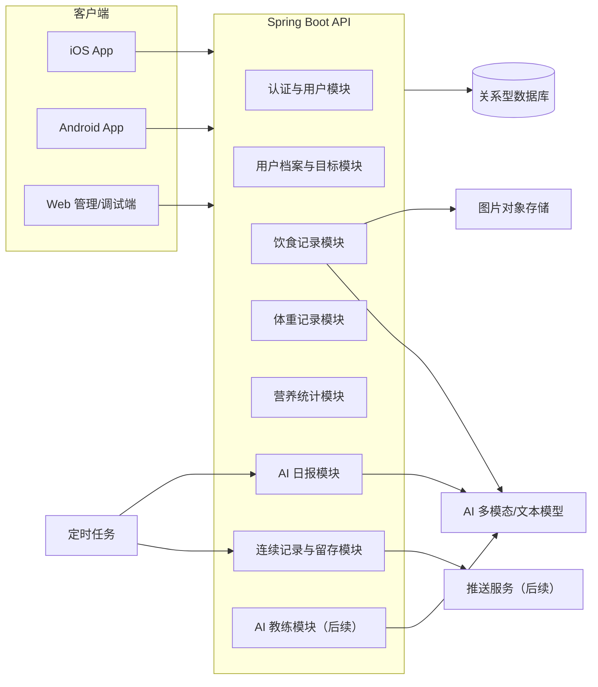
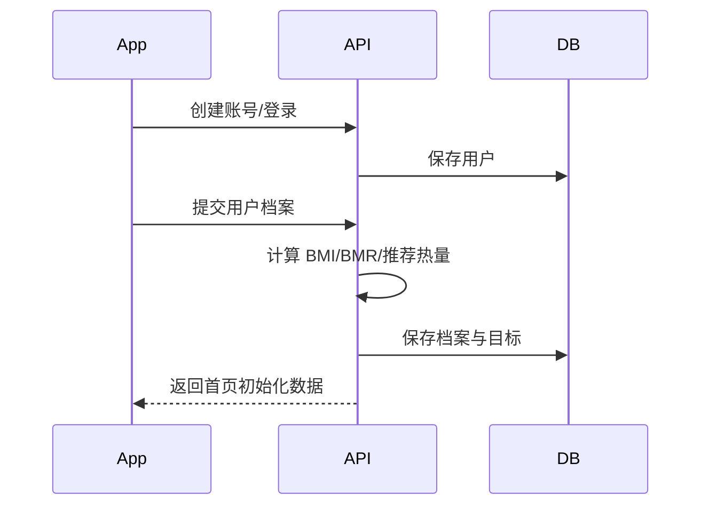
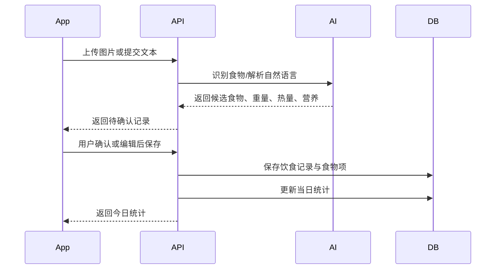
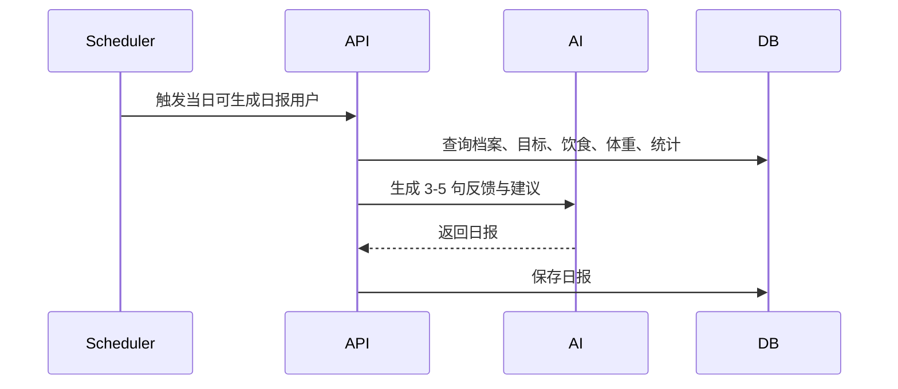

# LeanMate 总体架构设计

## 设计背景

LeanMate 的 V1.1 目标不是做一个功能很全的健康管理平台，而是验证用户是否愿意持续记录饮食和体重，以及 AI 日报是否能提升留存。后续规划会逐步扩展到 AI 周报/月报、AI 教练、行为干预、个体减脂模型和长期陪伴。

因此架构需要同时满足两点：

- MVP 阶段足够简单，优先支撑快速验证。
- 业务边界提前清楚，避免后续 AI 教练、行为洞察、成就系统接入时重写核心数据模型。

## 架构原则

- 记录低成本：拍照、文本、手动三种入口最终汇入同一个饮食记录模型。
- 每次记录有反馈：饮食和体重写入后必须能更新统计、日报、连续记录状态。
- AI 能力边界清晰：AI 负责识别、解析、总结、建议，不直接持有核心业务真相。
- 数据先于智能：长期壁垒来自饮食、体重、行为和反馈数据，核心事件必须结构化保存。
- V1.1 开始接入后端：后端作为跨 iOS、Android、未来 Web 的统一业务入口和数据源。
- 先模块化单体，后按压力拆分：MVP 不拆微服务，但服务端内部必须按业务域分包。

## 系统视图



## 服务端架构

MVP 使用模块化单体，后端仍是一个 Spring Boot 应用，但按业务域组织代码，而不是只按 controller/service/repository 技术层平铺。

后端从 V1.1 起就是必选项，不把 iCloud/CloudKit 作为主后端。CloudKit 后续可以作为 iOS 端体验增强或本地备份方案，但核心账号、饮食、体重、统计、AI 日报、留存和行为数据以 LeanMate 后端为准。

建议结构：

```text
server/
└── src/main/java/com/leanmate/
    ├── LeanMateApplication.java
    ├── common/
    │   ├── api/              # 统一响应、分页、错误码
    │   ├── security/         # 认证、鉴权、当前用户
    │   ├── exception/        # 全局异常处理
    │   └── time/             # 日期、时区、业务日计算
    ├── user/
    │   ├── auth/
    │   ├── profile/
    │   └── goal/
    ├── diet/
    │   ├── entry/            # 饮食记录
    │   ├── recognition/      # 图片识别、文本解析
    │   └── nutrition/        # 热量与营养估算
    ├── weight/
    ├── stats/
    ├── report/
    │   ├── daily/
    │   └── prompt/
    ├── retention/
    │   ├── streak/
    │   └── achievement/
    └── ai/
        ├── client/           # AI 供应商适配
        └── task/             # AI 任务编排
```

这样做的原因是 LeanMate 的长期复杂度主要来自业务域之间的组合：饮食、体重、目标、日报、留存、行为洞察。如果只按技术层放文件，后期很容易出现一个巨大的 `service/` 目录。

## 客户端架构

客户端优先围绕用户核心流程拆分功能模块：

- onboarding：注册、登录、用户档案、目标生成。
- home：今日热量、剩余热量、体重、连续打卡、日报摘要。
- diet-log：拍照记录、文本记录、手动记录、确认编辑。
- weight-log：体重记录、7/30 天趋势。
- report：AI 日报详情，后续扩展周报、月报。
- profile：个人档案、目标调整、账号设置。

iOS 和 Android 都建议采用 feature-first 目录。共享规则由 OpenAPI 和领域模型约束，不强求两端内部目录完全一致。

## 核心流程

### 首次使用



### 饮食记录



### AI 日报



## 数据存储策略

MVP 优先使用关系型数据库保存核心业务数据：

- 用户、档案、目标。
- 饮食记录、食物项、营养估算。
- 体重记录。
- 每日统计快照。
- AI 日报。
- 连续记录与成就。

图片文件不进数据库，放对象存储，数据库只保存文件 URL、识别状态和来源记录。

长期 AI 教练和行为洞察需要补充两类数据：

- 行为事件：打开 App、记录、编辑、查看日报、采纳建议、连续未记录等。
- AI 记忆摘要：按周/月沉淀用户高频问题、触发因素、可执行策略。

## AI 能力分层

```text
AI 能力
├── 识别层：图片识别、文本解析
├── 总结层：AI 日报、周报、月报
├── 分析层：饮食问题、体重趋势、行为模式
└── 陪伴层：AI 问答、教练模式、行为干预
```

MVP 只实现识别层和日报总结层。分析层和陪伴层可以先通过接口和数据模型预留，不在 V1.1 强行实现。

## 阶段演进

### V1.1 MVP

- 用户档案与目标。
- 饮食记录：图片、文本、手动。
- 体重记录。
- 今日统计。
- AI 日报。
- 连续打卡。

### 3-6 个月

- 成就系统。
- AI 周报、月报。
- 目标达成里程碑。
- 留存指标与行为事件采集。

### 6-12 个月

- AI 饮食分析。
- 体重趋势预测。
- AI 问答。
- 建议采纳率统计。

### 12 个月以后

- 减脂风险预警。
- 行为洞察。
- 个性化减脂模型。
- 不同 AI 陪伴模式。

## 暂不做的设计

- 不拆微服务。
- 不在 MVP 引入复杂推荐系统。
- 不把食物数据库做成核心竞争点。
- 不优先接 Apple Health、智能设备、运动、睡眠、社区和商城。
- 不把 AI 输出作为不可修改的事实数据，用户确认后的结构化记录才是业务真相。
