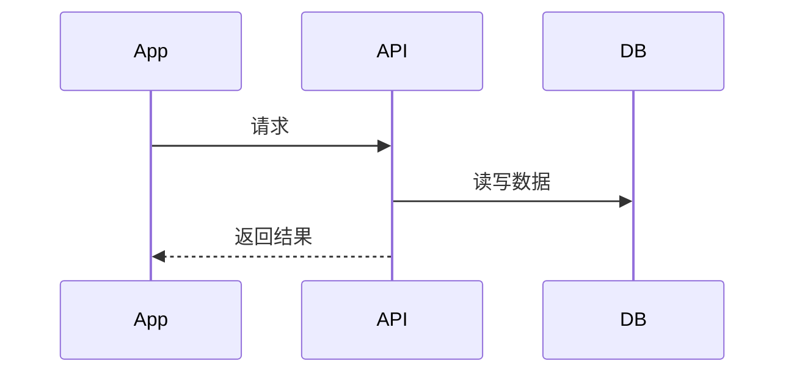

# 需求名称后端技术方案

## 基本信息

- 版本：
- 对应 PRD：
- 负责人：
- 状态：草案 / 评审中 / 已确认 / 已实现

## 业务目标

说明这个需求解决什么问题，成功后用户或业务会发生什么变化。

## 后端职责

- 

## 不做范围

- 

## 核心流程



## 数据模型影响

详细数据库设计：

- `server/docs/database-design.md`

新增或修改的表：

- 

关键字段：

- 

索引和约束：

- 

事务和一致性：

- 

## API 影响

人类可读 API 设计：

- 

新增接口：

- 

修改接口：

- 

相关 OpenAPI 文件：

- `docs/api/openapi.yaml`

OpenAPI 更新要求：

- 

## 业务规则

- 

## 状态流

```text
initial -> next -> final
```

## 权限和数据归属

- 

## 异步任务

- 同步处理 / 异步处理：
- 任务状态：
- 失败重试：
- 是否需要 Redis/MQ：

## AI 和外部服务

- 是否涉及 AI Provider：
- 是否涉及对象存储：
- 是否涉及第三方登录：
- 超时、限流、成本控制：

## 安全和合规

- 鉴权：
- 数据归属：
- 敏感数据：
- 日志脱敏：

## 环境和配置

- 环境变量：
- local/dev/prod 差异：
- 是否需要更新 `.env.*.example`：

## 异常和降级

- 

## 埋点和指标

- 

## 测试要点

- 

## 上线和兼容

- 数据库迁移：
- 兼容性：
- 回滚：

## 待确认问题

- 
