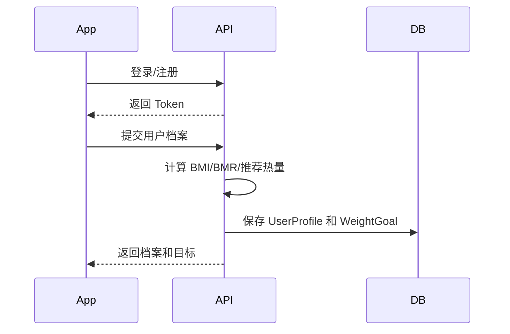

# 用户档案与目标后端技术方案

## 基本信息

- 版本：V1.1
- 对应 PRD：8.1 用户档案、9 首次使用
- 状态：草案

## 业务目标

用户首次进入 App 后完成基础身体信息填写，后端计算 BMI、BMR 和每日推荐热量目标，为首页统计、饮食记录和 AI 日报提供基础数据。

## 后端职责

- 提供账号登录后的当前用户上下文。
- 保存用户档案。
- 计算并保存 BMI、BMR、每日推荐热量目标。
- 保存减脂目标快照。
- 为首页和 AI 日报提供用户目标数据。

## 不做范围

- V1.1 不做复杂个性化减脂计划。
- V1.1 不做 Apple Health 同步。
- V1.1 不把账号体系绑定死在 Apple 登录。

## 核心流程

## 数据模型影响

详细表结构见：

- `../../database-design.md`

核心表：

- `users`
- `user_auth_identities`
- `refresh_tokens`
- `user_profiles`
- `weight_goals`

关键规则：

- `user_profiles.user_id` 唯一。
- `weight_goals` 支持历史目标，当前目标用 `status = active` 标记。
- BMI、BMR、推荐热量保存为快照，避免公式变化影响历史解释。

## API 影响

人类可读 API 设计见：

- `api-design.md`

已有草案：

- `GET /v1/profile`
- `PUT /v1/profile`

需要补充：

- 登录/注册接口。
- Refresh Token 接口。
- 当前用户信息接口。

最终接口契约以 `../../../../docs/api/openapi.yaml` 为准。

## 业务规则

- 年龄、身高、当前体重、目标体重必须有合理范围校验。
- 目标体重不能小于危险阈值。
- 活动水平使用枚举，不接受自由文本。
- 用户更新当前体重时，不直接覆盖历史体重记录，正式体重趋势以 `weight_entries` 为准。

## 异常和降级

- 档案未完成时，首页接口返回 `profileCompleted = false`，客户端引导补全。
- 推荐热量计算失败时返回明确错误，不生成默认目标。

## 权限和数据归属

- 用户只能读取和更新自己的档案。
- 登录身份通过 `user_auth_identities` 绑定到 `users`。
- Refresh Token 只保存哈希值，不保存明文。

## 异步任务

- 本需求不需要异步任务。
- V1.1 不需要 Redis/MQ。

## 埋点和指标

- `profile_started`
- `profile_completed`
- `goal_generated`

## 测试要点

- BMI/BMR 计算正确。
- 缺失必填字段返回参数错误。
- 重复提交档案时正确更新。
- 档案未完成用户不能生成完整首页统计。

## 待确认问题

- V1.1 首发是否只支持 Sign in with Apple，还是同时支持手机号/邮箱。
- 推荐热量目标公式采用哪一版，需要产品确认。
