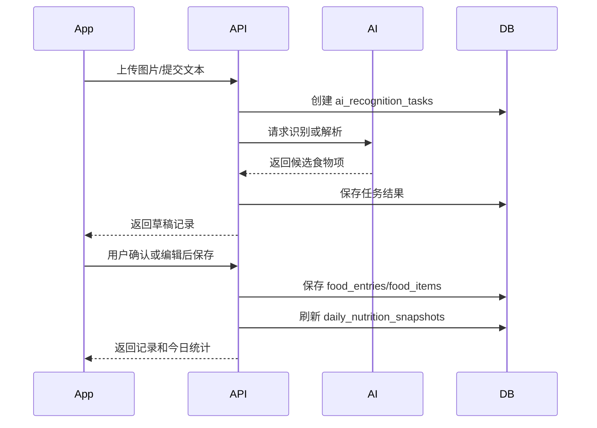
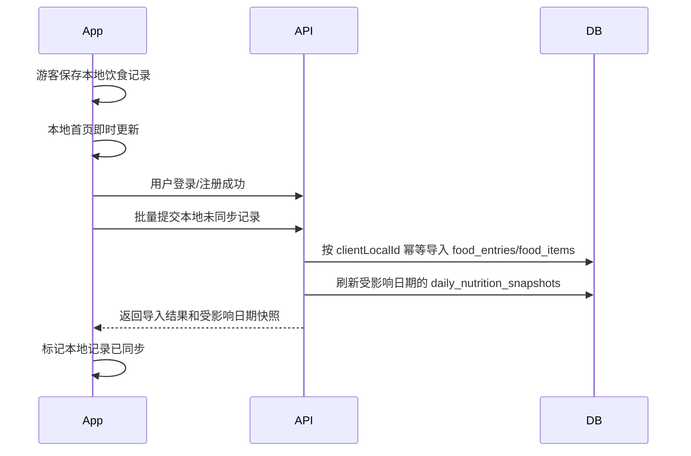

# 饮食记录后端技术方案

## 基本信息

- 版本：V1.1
- 对应 PRD：8.3 饮食记录
- 状态：手动记录、AI 识别任务和游客本地记录同步接口已实现

## 业务目标

支持拍照、文本、手动三种饮食记录方式，降低用户记录成本。AI 识别结果必须经过用户确认，确认后的结构化记录才进入今日统计和 AI 日报数据源。

## 后端职责

- 接收饮食图片或文本。
- 创建 AI 识别/解析任务。
- 保存 AI 原始输出和结构化候选食物。
- 保存用户确认后的饮食记录。
- 支持饮食记录编辑和删除。
- 触发当日营养统计快照刷新。

## 不做范围

- V1.1 不建设完整食物数据库。
- V1.1 不做复杂单位换算体系。
- V1.1 不保证 AI 热量估算完全准确，用户可以编辑。

## 核心流程

### 登录用户记录流程



### 游客本地记录和登录后同步

V1.1 iOS 支持轻干扰首次进入：用户未登录时也可以进入首页、记录饮食，并在本地看到今日热量更新。这里需要分成两条数据链路：

- 登录态：拍照、文本、手动记录全部走后端接口，后端保存 confirmed 记录并刷新统计快照。
- 游客态：记录保存到客户端本地正式记录区，不调用保存接口；首页基于本地记录即时计算展示。
- 游客登录后：客户端把本地未同步饮食记录批量同步给后端；同步成功后，后端数据成为主数据源，客户端可清理或标记本地记录为已同步。

同步流程：



同步约定：

- 客户端本地记录必须保存稳定的 `clientLocalId`，用于幂等导入和失败重试。
- 后端需要为导入记录保存 `clientLocalId` 或等价的去重键，去重范围是当前用户。
- 同步接口只接收游客本地已确认记录，不接收 AI 草稿。
- 如果批量数据中存在无效记录，后端应返回可定位到 `clientLocalId` 的错误信息；客户端保留失败项等待用户修改或重试。
- 记录可跨多个业务日期；后端需要刷新所有受影响日期的营养快照。
- 本地记录和远端记录发生重复时，V1.1 先按 `clientLocalId` 幂等去重，不做复杂内容相似度合并。

## 数据模型影响

详细表结构见：

- `../../database-design.md`

核心表：

- `food_entries`
- `food_items`
- `ai_recognition_tasks`
- `daily_nutrition_snapshots`

关键字段：

- `food_entries.source_type`：photo/text/manual
- `food_entries.status`：draft/confirmed/deleted
- `food_items.is_user_edited`
- `ai_recognition_tasks.status`：pending/running/succeeded/failed
- `ai_recognition_tasks.raw_output`
- 游客登录后同步时，`food_entries.client_local_id` 保存客户端本地记录 ID，并在 `(user_id, client_local_id)` 上建立唯一约束。

索引建议：

- `food_entries(user_id, meal_date, status)`
- `ai_recognition_tasks(user_id, created_at)`

## API 影响

人类可读 API 设计见：

- `api-design.md`

已有草案：

- `POST /v1/diet/recognitions/photo`
- `POST /v1/diet/recognitions/text`
- `GET /v1/diet/entries`
- `POST /v1/diet/entries`
- `POST /v1/diet/entries/sync-local`
- `PUT /v1/diet/entries/{entryId}`
- `DELETE /v1/diet/entries/{entryId}`

已确认：

- `POST /v1/diet/recognitions/photo`、`POST /v1/diet/recognitions/text`、`GET /v1/diet/recognitions/{taskId}` 已实现。
- 保存饮食记录后返回 `entry` 和刷新后的 `today` 统计快照。
- `POST /v1/diet/entries/sync-local` 用于登录后批量导入游客本地记录；后端已实现按当前用户和 `clientLocalId` 幂等导入。

最终接口契约以 `../../../../docs/api/openapi.yaml` 为准。

## 业务规则

- AI 识别结果默认是草稿，不进入统计。
- 手动录入可以直接保存为 `confirmed`。
- confirmed 记录被编辑后必须重新计算总热量和营养。
- 删除记录使用软删除，避免影响审计和问题排查。
- 用户只能操作自己的饮食记录。
- 保存、编辑、删除饮食记录都要求用户已完成档案，以便生成当日热量目标快照。
- 本批次 `POST /v1/diet/entries`、`PUT /v1/diet/entries/{entryId}` 保存的记录均作为 `confirmed` 记录进入统计。
- 编辑记录如果改变 `mealDate`，旧日期和新日期的统计快照都要刷新。
- 游客本地记录在登录后导入服务端时，也作为 `confirmed` 记录进入统计，并触发受影响日期快照刷新。

## 营养数据输入和校验策略

客户端可以传入用户确认后的食物项、重量、热量和营养素。这个设计是必要的，因为 AI 识别结果可能不准，用户必须能在确认页修正食物、份量和热量。

后端不能完全信任客户端传入的营养数据。保存饮食记录前执行合理性校验，普通保存、编辑和游客本地记录同步共用同一套校验规则：

- 整餐总热量不由客户端传入，始终由后端根据 `items` 汇总。
- 食物项热量、重量、蛋白质、脂肪、碳水不能为负数。
- 单个食物项热量不超过 5000 kcal，重量不超过 10000g，单项宏量营养素不超过 1000g。
- 当 `weightG` 存在时，按 `caloriesKcal / weightG * 100` 计算每 100g 热量，超过 1000 kcal/100g 时拒绝。
- 当三大营养素存在时，用 `proteinG * 4 + carbsG * 4 + fatG * 9` 估算理论热量；与 `caloriesKcal` 偏差过大时拒绝。
- AI 估算、食物库匹配、用户确认、用户手动覆盖应作为不同来源保存或推导，便于后续质量分析。

目标营养来源枚举：

```text
ai_estimated
food_db
user_confirmed
user_override
```

食物热量查询和食物库能力后续单独设计；当前饮食保存接口不临时内置复杂食物库逻辑。

## 异常和降级

- AI 识别失败时，返回失败状态和可读错误，客户端允许切换手动录入。
- 图片上传失败时不创建正式饮食记录。
- AI 返回缺失营养字段时，允许字段为空，但保存前用户确认页要可编辑。

## 权限和数据归属

- 用户只能访问和修改自己的识别任务、饮食记录和食物项。
- `food_items` 只能通过所属 `food_entries` 聚合更新，不单独暴露跨记录修改接口。

## 异步任务

- 拍照识别和文本解析按异步任务设计，状态保存在 `ai_recognition_tasks`。
- V1.1 使用数据库任务表，不引入 MQ。
- 识别失败不阻断手动录入。

## 埋点和指标

- `diet_recognition_started`
- `diet_recognition_succeeded`
- `diet_recognition_failed`
- `diet_entry_confirmed`
- `diet_entry_edited`
- `first_diet_entry_completed`

## 测试要点

- 三种 source_type 都能保存。
- 草稿不进入今日统计。
- confirmed 后刷新当日统计。
- 食物项营养数据离谱时不能进入统计。
- 编辑、删除后统计正确回滚或重算。
- 非本人记录不可访问。

## 待确认问题

- 拍照识别是同步等待结果，还是一律异步任务轮询。
- 图片是否需要设置保存期限。
- 食物营养估算采用 AI 直接返回，还是接入第三方食物营养库。
- 游客本地图片记录登录后同步时，图片是否需要补上传对象存储，以及失败时是否允许先同步无图饮食记录。
