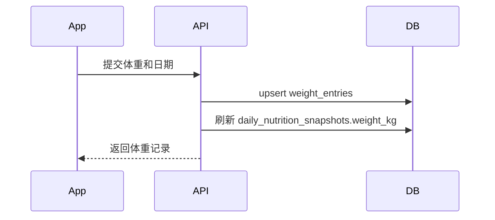

# 体重记录后端技术方案

## 基本信息

- 版本：V1.1
- 对应 PRD：8.4 体重记录
- 状态：草案

## 业务目标

用户每日记录体重，首页展示当前体重，趋势页支持 7 天和 30 天变化趋势，AI 日报可引用当日体重变化。

## 后端职责

- 保存每日体重记录。
- 支持按日期范围查询体重记录。
- 同一天重复记录时按业务规则更新或覆盖。
- 将最新体重同步到首页统计快照。

## 不做范围

- V1.1 不接智能体脂秤。
- V1.1 不接 Apple Health。
- V1.1 不做体脂率、肌肉量等复杂指标。

## 核心流程

## 数据模型影响

详细表结构见：

- `../../database-design.md`

核心表：

- `weight_entries`
- `daily_nutrition_snapshots`

约束建议：

- `weight_entries(user_id, record_date)` 唯一。

索引建议：

- `weight_entries(user_id, record_date)`

## API 影响

人类可读 API 设计见：

- `api-design.md`

已有草案：

- `GET /v1/weights`
- `POST /v1/weights`

需要明确：

- 同一天重复提交是覆盖还是创建多条。V1.1 建议覆盖。
- 是否需要 `DELETE /v1/weights/{entryId}`。V1.1 可以暂不提供，先支持覆盖。

最终接口契约以 `../../../../docs/api/openapi.yaml` 为准。

## 业务规则

- 体重范围必须校验。
- 业务日期不能明显晚于当前日期。
- 查询区间最大跨度建议限制为 180 天，避免无边界查询。
- 趋势数据由客户端根据记录列表绘制，服务端只返回标准记录。

## 异常和降级

- 离线提交失败时，客户端保留本地待同步记录。
- 后端发现同一天已有记录时执行覆盖，并更新时间。

## 权限和数据归属

- 用户只能查询和写入自己的体重记录。
- 同一天唯一约束为 `weight_entries(user_id, record_date)`。

## 异步任务

- 本需求不需要异步任务。
- 保存体重后同步刷新当日统计快照。

## 埋点和指标

- `weight_entry_created`
- `first_weight_entry_completed`
- `weight_entry_updated`

## 测试要点

- 同一天重复提交覆盖。
- 日期范围查询正确。
- 非法体重返回参数错误。
- 非本人记录不可访问。

## 待确认问题

- 首页当前体重优先取最近一次体重记录，还是用户档案中的当前体重。
