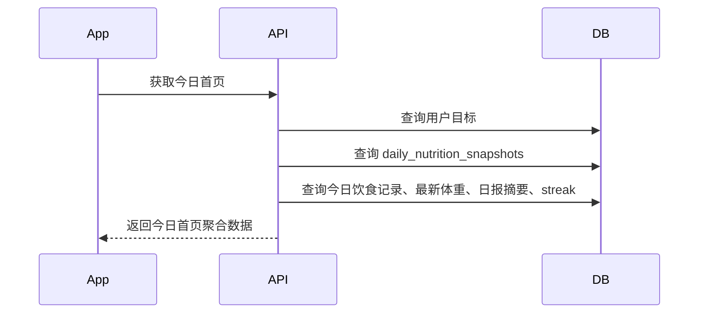

# 首页统计与连续打卡后端技术方案

## 基本信息

- 版本：V1.1
- 对应 PRD：8.2 首页、8.6 连续打卡
- 状态：草案

## 业务目标

首页展示用户今日减脂状态，包括目标热量、已摄入热量、剩余热量、当前体重、连续打卡天数、今日饮食记录和 AI 日报摘要。连续打卡用于强化用户留存。

## 后端职责

- 维护每日营养统计快照。
- 提供首页今日聚合接口。
- 维护连续打卡状态和历史最长记录。
- 触发里程碑成就。

## 不做范围

- V1.1 不做复杂成就体系。
- V1.1 不做排行榜。
- V1.1 不做社交分享。

## 核心流程

## 数据模型影响

详细表结构见：

- `../../database-design.md`

核心表：

- `daily_nutrition_snapshots`
- `streaks`
- `achievements`
- `food_entries`
- `weight_entries`
- `daily_ai_reports`

索引建议：

- `daily_nutrition_snapshots(user_id, date)` 唯一。
- `streaks(user_id)` 唯一。
- `achievements(user_id, type)` 唯一。

## API 影响

人类可读 API 设计见：

- `api-design.md`

已有草案：

- `GET /v1/home/today`
- `GET /v1/retention/streak`

需要明确：

- 首页接口是否包含今日饮食记录完整列表。V1.1 可以包含简化列表。
- 首页接口是否包含 `profileCompleted`，用于首次使用引导。

最终接口契约以 `../../../../docs/api/openapi.yaml` 为准。

## 业务规则

- 今日统计优先读取快照，不每次实时聚合全量明细。
- 饮食记录 confirmed 后刷新快照。
- 体重记录保存后刷新快照中的体重字段。
- 有效记录日：当天完成至少一条 confirmed 饮食记录或一条体重记录。
- 连续打卡里程碑：3、7、30、100 天。

## 异常和降级

- 当天快照不存在时，后端按用户目标初始化空快照。
- 用户档案未完成时，首页返回引导状态，不返回完整目标统计。
- 日报未生成时，`reportSummary` 返回 null。

## 权限和数据归属

- 用户只能读取自己的首页统计、连续打卡和成就。
- 首页聚合数据不能跨用户读取。

## 异步任务

- V1.1 首页读取不需要异步任务。
- 连续打卡可以在饮食/体重写入后同步刷新，也可以由每日定时任务兜底修复。
- V1.1 不需要 Redis/MQ。

## 埋点和指标

- `home_viewed`
- `streak_updated`
- `streak_milestone_unlocked`
- `three_day_streak_completed`
- `seven_day_streak_completed`

## 测试要点

- 空数据用户首页能正常返回。
- 饮食记录新增、编辑、删除后快照正确。
- 体重记录后首页当前体重正确。
- 连续打卡跨天计算正确。
- 断签后 current_days 正确重置。

## 待确认问题

- 有效记录日是否只需饮食或体重之一，还是必须两者都完成。
- 连续打卡按用户本地时区还是统一 UTC 业务日。建议按用户本地时区。
