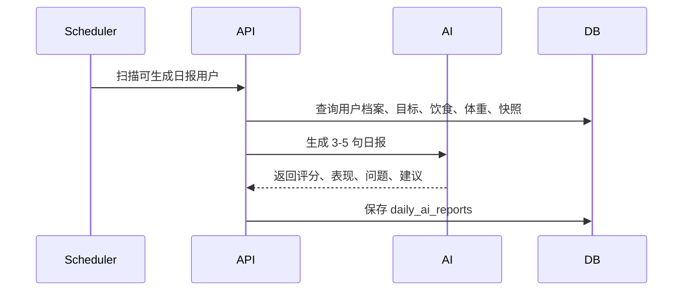

# AI 日报后端技术方案

## 基本信息

- 版本：V1.1
- 对应 PRD：8.5 AI 日报
- 状态：草案

## 业务目标

每天基于用户档案、目标、饮食记录、体重记录和今日统计生成简短、可执行的 AI 日报，验证 AI 反馈是否提升用户留存。

## 后端职责

- 判断用户当日是否满足日报生成条件。
- 汇总日报上下文数据。
- 调用 AI Provider 生成日报。
- 保存日报内容、状态和生成依据。
- 提供日报查询和查看状态更新。

## 不做范围

- V1.1 不做 AI 聊天。
- V1.1 不做周报、月报。
- V1.1 不做复杂长期记忆。

## 核心流程

## 数据模型影响

详细表结构见：

- `../../database-design.md`

核心表：

- `daily_ai_reports`
- `daily_nutrition_snapshots`
- `food_entries`
- `weight_entries`
- `ai_recognition_tasks`

关键字段：

- `daily_ai_reports.status`：pending/generated/viewed/failed
- `daily_ai_reports.score`
- `daily_ai_reports.summary`
- `daily_ai_reports.problem`
- `daily_ai_reports.suggestion`
- `daily_ai_reports.generated_from_snapshot_id`
- `daily_ai_reports.raw_output`

约束建议：

- `daily_ai_reports(user_id, report_date)` 唯一。

## API 影响

人类可读 API 设计见：

- `api-design.md`

已有草案：

- `GET /v1/reports/daily`
- `POST /v1/reports/daily`

需要补充：

- `POST /v1/reports/daily/{reportId}/view` 标记日报已查看。
- 生成失败时的错误码和重试规则。

最终接口契约以 `../../../../docs/api/openapi.yaml` 为准。

## 业务规则

- 当天至少有一条饮食记录或体重记录，才生成日报。
- 日报内容要求简洁，3-5 句话，可执行建议。
- 同一天重复生成默认覆盖当前日报，但保留更新时间和原始输出。
- 日报生成使用当时的统计快照，避免用户后续编辑记录后日报语义漂移。

## 异常和降级

- AI 调用失败时保存 failed 状态，不影响用户继续记录。
- 日报未生成时，首页只展示空摘要。
- 用户可以手动触发生成或重试，但需要限制频率。V1.1 可先用数据库字段控制。

## 权限和数据归属

- 用户只能查询、生成、查看自己的 AI 日报。
- 日报生成上下文只读取当前用户的档案、目标、饮食、体重和统计快照。

## 异步任务

- 日报生成按异步任务处理，状态保存在 `daily_ai_reports.status`。
- V1.1 可用 Spring Scheduler 扫描 pending/failed 状态，不引入 MQ。
- AI 失败只影响日报，不影响饮食和体重记录。

## 埋点和指标

- `daily_report_generated`
- `daily_report_failed`
- `daily_report_viewed`
- `daily_report_regenerated`

## 测试要点

- 无记录用户不生成日报。
- 有记录用户能生成日报。
- 同一天只能有一个有效日报。
- 查看日报后状态更新。
- AI 失败不影响饮食和体重记录。

## 待确认问题

- 日报生成时机：用户主动触发、每天固定时间，还是两者都支持。
- V1.1 是否需要推送提醒用户查看日报。
