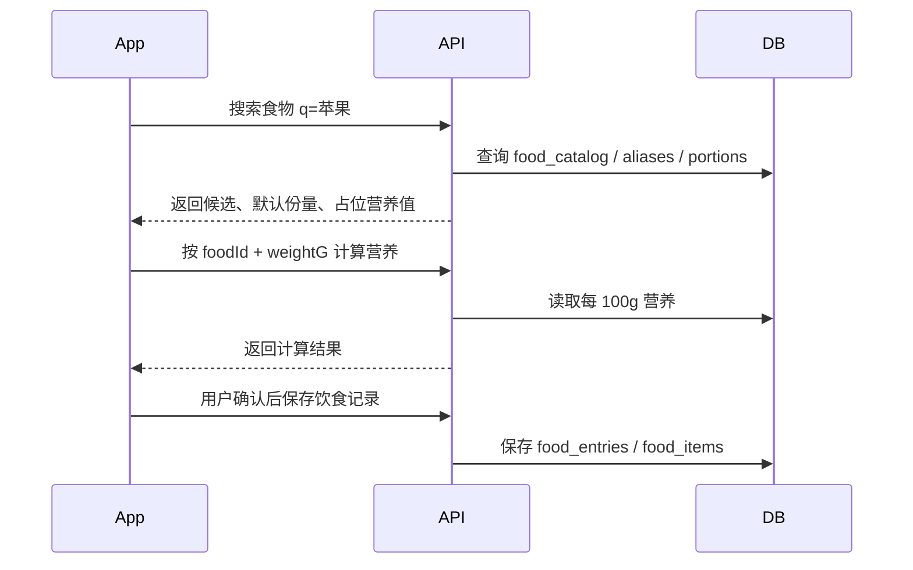
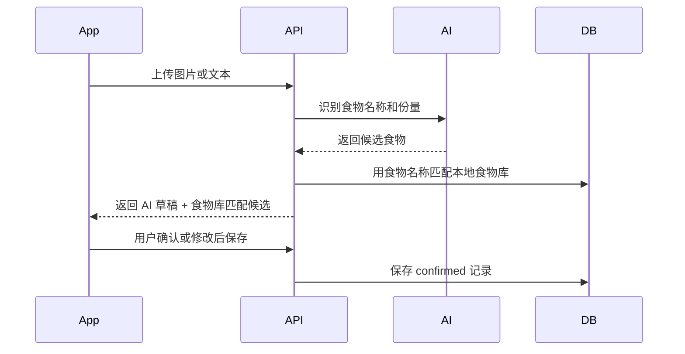

# 本地基础食物库后端技术方案

## 基本信息

- 版本：V1.1
- 对应 PRD：8.3 饮食记录
- 状态：草案

## 业务目标

降低用户手动记录饮食的成本。用户输入或选择“苹果”“鸡胸肉”“米饭”后，客户端可以拿到默认份量和估算营养值作为占位提示；用户输入重量后，后端按本地食物库统一计算热量和三大营养素。

本功能不是替代用户确认，而是为手动录入、AI 识别结果确认和后续扫码记录提供稳定的营养数据基础。

## 后端职责

- 维护一个小而准的本地基础食物库。
- 支持按关键词搜索食物。
- 支持返回食物详情、默认份量和常见份量。
- 支持按 `foodId + weightG` 或默认份量计算营养值。
- 给 AI 识别结果和用户手动输入提供标准食物候选项。
- 饮食记录保存时支持引用 `foodId`，但仍允许用户确认后覆盖营养值。

## 不做范围

- V1.1 不建设完整商品库。
- V1.1 不接入复杂商业营养 API。
- V1.1 不做用户自定义食物沉淀为公共食物库。
- V1.1 不自动替用户确认 AI 识别结果。
- 食物库结果不是医学或营养治疗建议。

## 核心流程

### 手动录入



### AI 识别结果确认



### 默认份量占位提示

用户只选择“苹果”但没有填写重量时，后端返回默认份量估算：

```json
{
  "foodId": "apple",
  "name": "苹果",
  "defaultPortion": {
    "label": "1个中等大小",
    "gramWeight": 180
  },
  "estimatedNutrition": {
    "caloriesKcal": 94,
    "proteinG": 0.5,
    "fatG": 0.4,
    "carbsG": 25.0
  },
  "estimateBasis": "default_portion",
  "displayHint": "按 1个中等大小 估算，可修改重量"
}
```

客户端可以把这些值作为 placeholder 或预填值展示，但保存前仍需要用户确认。

## 数据模型影响

详细数据库设计：

- `../../database-design.md`

新增表：

- `food_catalog`
- `food_aliases`
- `food_portions`

### food_catalog

食物主表，保存标准化食物及每 100g 营养值。

关键字段：

- `id`
- `name`
- `normalized_name`
- `category`
- `calories_per_100g`
- `protein_per_100g`
- `fat_per_100g`
- `carbs_per_100g`
- `source`
- `confidence`
- `verified`
- `locale`
- `created_at`
- `updated_at`

建议约束：

- `normalized_name` 唯一或按 `(locale, normalized_name)` 唯一。
- 每 100g 热量和营养素不能为负数。
- 每 100g 热量不超过 1000 kcal。

### food_aliases

保存别名，提升中文搜索和 AI 结果匹配效果。

关键字段：

- `id`
- `food_id`
- `alias`
- `normalized_alias`
- `locale`

索引：

- `food_aliases(normalized_alias)`
- `food_aliases(food_id)`

### food_portions

保存默认份量和常见份量。

关键字段：

- `id`
- `food_id`
- `label`
- `gram_weight`
- `is_default`
- `sort_order`

示例：

```json
{
  "food": "苹果",
  "portions": [
    {
      "label": "1个中等大小",
      "gramWeight": 180,
      "isDefault": true
    },
    {
      "label": "半个",
      "gramWeight": 90,
      "isDefault": false
    }
  ]
}
```

### food_items 修改

饮食记录明细建议增加：

- `food_catalog_id`：可为空，用户完全自定义记录时为空。
- `nutrition_source`：`food_db`、`ai_estimated`、`user_confirmed`、`user_override`。

保存规则：

- 如果用户直接采用食物库计算值，`nutrition_source = food_db`。
- 如果 AI 估算且用户未改，`nutrition_source = ai_estimated`。
- 如果用户确认了食物库或 AI 的值，`nutrition_source = user_confirmed`。
- 如果用户手动改了热量、重量或营养素，`nutrition_source = user_override`。

## API 影响

人类可读 API 设计：

- `api-design.md`

新增接口草案：

- `GET /v1/foods/search`
- `GET /v1/foods/{foodId}`
- `POST /v1/foods/calculate`

后续接口：

- `GET /v1/foods/barcode/{barcode}`：等接入包装食品和外部数据源时再做。

### GET /v1/foods/search

按关键词搜索本地食物库。

请求：

```json
{
  "query": {
    "q": "苹果",
    "limit": 10
  }
}
```

响应：

```json
{
  "code": 0,
  "message": "success",
  "data": [
    {
      "id": "food-apple",
      "name": "苹果",
      "category": "fruit",
      "caloriesPer100g": 52,
      "proteinPer100g": 0.3,
      "fatPer100g": 0.2,
      "carbsPer100g": 13.8,
      "defaultPortion": {
        "label": "1个中等大小",
        "gramWeight": 180
      },
      "estimatedNutrition": {
        "caloriesKcal": 94,
        "proteinG": 0.5,
        "fatG": 0.4,
        "carbsG": 24.8
      },
      "estimateBasis": "default_portion",
      "displayHint": "按 1个中等大小 估算，可修改重量"
    }
  ]
}
```

### GET /v1/foods/{foodId}

获取食物详情和全部份量。

### POST /v1/foods/calculate

按重量或份量计算营养值。

请求：

```json
{
  "foodId": "food-apple",
  "weightG": 180
}
```

或：

```json
{
  "foodId": "food-apple",
  "portionId": "portion-apple-medium"
}
```

响应：

```json
{
  "code": 0,
  "message": "success",
  "data": {
    "foodId": "food-apple",
    "name": "苹果",
    "weightG": 180,
    "caloriesKcal": 94,
    "proteinG": 0.5,
    "fatG": 0.4,
    "carbsG": 24.8,
    "estimateBasis": "weight"
  }
}
```

### POST /v1/diet/entries 影响

`items[]` 建议增加：

```json
{
  "foodId": "food-apple",
  "name": "苹果",
  "quantityText": "1个中等大小",
  "weightG": 180,
  "caloriesKcal": 94,
  "proteinG": 0.5,
  "fatG": 0.4,
  "carbsG": 24.8,
  "nutritionSource": "food_db",
  "userEdited": false
}
```

后端仍以食物项明细为准计算整餐总量，并继续执行营养合理性校验。

## 业务规则

- 本地基础食物库是 V1.1 食物热量查询的主链路。
- 食物库默认份量只能作为估算提示，不代表用户实际摄入。
- 用户没有输入重量时，优先使用 `is_default = true` 的份量返回 placeholder。
- 用户输入重量时，后端按每 100g 营养值换算。
- 用户可以覆盖食物库估算值；覆盖后必须通过营养合理性校验。
- 食物库计算结果不直接创建饮食记录，必须经由用户保存饮食记录。
- AI 识别结果应尽量匹配到 `food_catalog_id`，匹配不到时仍可作为自定义食物草稿返回。
- 外部 API 返回的数据不能直接进入统计，必须先标准化、缓存或映射成本地结构。

## 用户修正边界

用户修正的是自己本次饮食记录里的食物项数据，不是公共基础食物库数据。

示例：

公共食物库中的苹果：

```json
{
  "name": "苹果",
  "caloriesPer100g": 52,
  "defaultPortion": {
    "label": "1个中等大小",
    "gramWeight": 180
  }
}
```

用户今天实际只吃了半个苹果，可以把本次饮食记录改成：

```json
{
  "foodId": "food-apple",
  "name": "苹果",
  "quantityText": "半个",
  "weightG": 90,
  "caloriesKcal": 47,
  "nutritionSource": "user_override",
  "userEdited": true
}
```

这次修改只保存到 `food_items`，不会回写 `food_catalog`。因此大量用户编辑自己的记录不会污染公共基础食物库。

数据修改权限边界：

```text
food_catalog      公共基础食物库，只允许运营/管理员/迁移脚本修改
food_items        用户某一次饮食记录里的食物数据，用户可以修改自己的记录
user_foods        用户自己的常用食物，用户自己可维护
food_external_cache 外部接口缓存，低可信，不直接影响公共库
```

如果用户认为公共食物库数据不准确，后续应走反馈和审核流程：

```text
用户提交数据问题反馈
后台收集反馈
运营或管理员核对营养来源
确认后更新 food_catalog / food_portions
发布后影响后续搜索和计算
历史 food_items 不自动回写
```

历史饮食记录保存的是当时用户确认后的值。即使公共库后续修正，也不自动改历史记录，避免历史统计口径变化。

## 种子库策略

V1.1 一开始需要建立一个小而准的基础食物库，建议 100-200 个高频食物。

首批分类：

- 主食：米饭、面条、馒头、包子、粥、面包、玉米、红薯。
- 蛋白：鸡蛋、鸡胸肉、牛肉、猪肉、鱼、虾、豆腐、牛奶、酸奶。
- 蔬菜：西兰花、青菜、番茄、黄瓜、土豆、胡萝卜、菠菜。
- 水果：苹果、香蕉、橙子、草莓、葡萄、梨、蓝莓。
- 饮品：豆浆、拿铁、美式咖啡、奶茶、可乐、无糖可乐。
- 零食：坚果、饼干、薯片、巧克力。
- 常见外卖：沙拉、麻辣烫、黄焖鸡、盖饭、炒饭、炒面。

数据来源优先级：

1. 人工整理并审核的基础食物。
2. USDA FoodData Central 等公开数据源，用于基础食材参考。
3. 后续 Open Food Facts，用于包装食品和条形码。
4. AI 估算只用于候选，不直接作为高可信食物库数据。

种子数据必须包含：

- 标准名称。
- 常见别名。
- 每 100g 热量和三大营养素。
- 至少一个默认份量。

### 种子数据维护方式

基础食物库数据不继续写进 Java 代码，也不在后续迁移里手写大段 `insert`。

V1.1 后端启动时会读取下面 3 个 CSV 文件，并幂等 upsert 到数据库：

```text
server/src/main/resources/db/seed/food-catalog/foods.csv
server/src/main/resources/db/seed/food-catalog/aliases.csv
server/src/main/resources/db/seed/food-catalog/portions.csv
```

CSV 分工：

| 文件 | 作用 |
| --- | --- |
| `foods.csv` | 食物主数据：名称、分类、每 100g 热量和三大营养素、来源、可信度、是否审核 |
| `aliases.csv` | 搜索别名，例如“番茄”可配置“西红柿” |
| `portions.csv` | 默认份量和常见份量，例如“1个中等大小 = 180g” |

导入规则：

- 以 CSV 中的 `id` 作为稳定主键，重复启动不会重复插入。
- 已存在的食物会按 CSV 更新主数据。
- CSV 中某个食物的别名和份量是权威配置，启动导入时会覆盖该食物原有别名和份量。
- 不建议从 CSV 直接删除已经上线过的食物；需要下线时将 `verified` 改为 `false`，避免历史 `food_items.food_catalog_id` 失去可读性。
- 默认开启自动导入，可通过 `FOOD_CATALOG_SEED_ENABLED=false` 关闭。
- CSV 目录可通过 `FOOD_CATALOG_SEED_LOCATION` 覆盖，默认是 `classpath:db/seed/food-catalog`。

## 后续新增食物策略

新增食物不能全部直接进入公共基础食物库，需要按来源分层处理。

### 运营维护的公共基础食物

适用于高频、通用、可标准化的食物，例如“煎饼果子”“螺蛳粉”“烤冷面”。

流程：

```text
整理食物数据
人工确认每 100g 营养值和默认份量
追加或更新 foods.csv / aliases.csv / portions.csv
标记 source = curated，verified = true
运行测试确认 CSV 可被导入
发布后由后端启动导入器写入 food_catalog / food_aliases / food_portions
```

这类数据是最高可信来源，应优先展示在搜索结果前面。

### 用户自定义食物

适用于用户个人、家庭或非标准食物，例如“妈妈做的番茄炒蛋”“公司食堂鸡腿饭”。

V1.1 饮食记录保存时已经允许用户直接保存自定义食物项。后续可以扩展“保存为我的常用食物”，但不应直接进入公共基础食物库。

建议新增用户私有表：

```text
user_foods
- id
- user_id
- name
- normalized_name
- calories_per_100g
- protein_per_100g
- fat_per_100g
- carbs_per_100g
- default_portion_label
- default_portion_gram_weight
- created_at
- updated_at
```

后续用户私有接口：

```text
POST /v1/user-foods
GET /v1/user-foods/search
PUT /v1/user-foods/{foodId}
DELETE /v1/user-foods/{foodId}
```

用户私有食物只对创建者可见，不参与全局公共食物搜索排序，也不污染公共库。

### 外部来源补充

适用于包装食品、条形码商品或外部开放数据源返回的食物。

流程：

```text
外部 API 查到商品或食物
标准化成内部结构
写入 food_external_cache 或 unverified food_catalog
标记 source = open_food_facts / usda / vendor
标记 verified = false
用户可以使用
后台或人工审核后再转为 verified
```

外部数据不能直接作为高可信公共数据进入统计口径。用户使用外部数据保存饮食记录时，仍需要经过确认和营养合理性校验。

### 搜索结果合并排序

后续搜索可以按可信度和归属排序：

```text
1. 公共 verified 食物
2. 用户自己的 user_foods
3. 外部缓存或未审核食物
4. AI 估算候选
```

每个结果需要带来源和可信度，客户端可以展示不同提示：

```json
{
  "id": "food-apple",
  "name": "苹果",
  "source": "curated",
  "verified": true,
  "displayHint": "按 1个中等大小 估算，可修改重量"
}
```

未审核外部数据示例：

```json
{
  "id": "external-product-xxx",
  "name": "某品牌酸奶",
  "source": "open_food_facts",
  "verified": false,
  "displayHint": "来自外部食品标签数据，请确认份量"
}
```

## 权限和数据归属

- 食物库读取接口需要登录，便于后续做个性化排序和限流。
- V1.1 本地基础食物库为全局公共数据，不归属单个用户。
- 用户保存饮食记录后，食物项仍归属用户饮食记录。
- 用户自定义食物属于用户私有数据，只对创建者可见。

## 异步任务

- V1.1 本地食物库搜索和计算同步处理。
- 暂不需要 Redis/MQ。
- 后续外部数据源同步可做成后台任务。

## AI 和外部服务

- AI 识别结果需要尝试匹配食物库，返回候选供用户确认。
- V1.1 不强依赖外部食物 API。
- Open Food Facts 后续用于条形码和包装食品补充。
- 商业 API 后续根据成本、授权和中文食物覆盖再评估。

## 安全和合规

- 外部数据源需要确认授权和缓存限制。
- 日志不记录用户完整饮食详情，只记录必要的 ID、状态和错误原因。
- 食物库营养值需要明确为估算值，不作为医学建议。

## 环境和配置

- V1.1 本地食物库不需要新增外部 API Key。
- 基础食物库 CSV 默认启动自动导入：`FOOD_CATALOG_SEED_ENABLED=true`。
- 如需从外部路径加载 CSV，可设置 `FOOD_CATALOG_SEED_LOCATION`。
- 后续接 Open Food Facts 可先无 Key 使用公开 API，但需要遵守使用政策和请求频率。
- 后续接商业 API 时再新增环境变量。

## 异常和降级

- 搜索无结果时返回空数组，客户端允许用户自定义食物。
- 食物存在但无默认份量时，只返回每 100g 营养值。
- 计算接口缺少 `weightG` 和 `portionId` 时返回 `40001`。
- 食物被下线或不存在时返回 `40401`。
- 营养计算结果仍需通过现有饮食营养合理性校验。

## 埋点和指标

- `food_search_performed`
- `food_search_no_result`
- `food_selected`
- `food_nutrition_calculated`
- `food_custom_entry_used`

## 测试要点

- CSV 文件可以被解析，并能导入当前基础食物、别名和份量。
- 搜索标准名称和别名都能命中。
- 默认份量能返回占位营养值。
- 按重量计算营养值正确，保留合理小数位。
- 无重量且无份量时报参数错误。
- 饮食记录保存时可携带 `foodId`，同时保留用户覆盖能力。
- AI 识别结果匹配不到食物库时仍能保存为自定义食物。

## 上线和兼容

- 需要新增 Flyway 迁移、CSV 种子数据和启动导入器。
- 已有饮食记录不需要回填 `food_catalog_id`。
- `food_items.food_catalog_id` 可为空，保证兼容历史记录和用户自定义食物。
- 如果种子数据质量有问题，优先修正 CSV 后重新发布；这不会改写历史饮食记录中已经保存的原始营养值。

## 待确认问题

- 首批 100-200 个基础食物清单由谁审核。
- 默认份量是否需要区分地区或用户习惯。
- 中文分词和模糊搜索第一版采用数据库 `like`，还是引入更强搜索能力。
- 包装食品条形码能力是否进入 V1.1，还是 V1.2。
