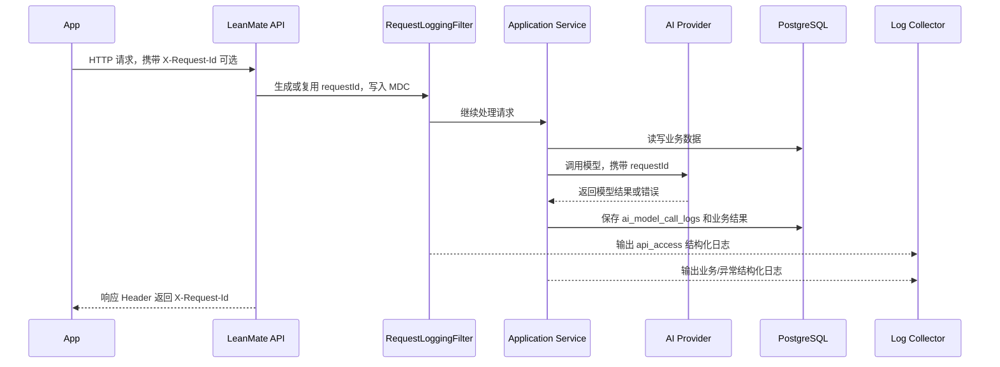

# 后端日志与可观测性技术方案

## 基本信息

- 版本：V1.1
- 对应 PRD：横切能力，支撑线上问题排查、AI 成本与稳定性分析
- 状态：草案

## 背景

当前服务端已有基础日志能力：

- Spring Boot 默认日志，通过 `LOG_LEVEL` 控制级别。
- `LOG_SQL` 可开启 SQL 输出。
- 全局异常处理器会记录未处理异常。
- 饮食 AI 识别和 AI 日报失败时会记录少量 `warn` 日志。
- `ai_recognition_tasks` 和 `daily_ai_reports` 会保存 AI 业务任务状态、原始输出和错误信息。

但当前还缺少系统化的线上排查能力：

- 没有统一接口访问日志，无法快速回答“某个用户某个接口什么时候失败、耗时多少、返回什么错误码”。
- 没有统一 `requestId` / `traceId`，跨 Controller、应用服务、AI Provider 排查不方便。
- AI 调用只保存在业务结果表中，没有独立记录每次模型调用的耗时、token 用量、HTTP 状态、失败分类和成本口径。
- 日志脱敏和保留期限没有明确工程规范。
- 线上告警指标没有统一来源。

## 业务目标

- 线上问题可以通过 `requestId` 快速串起一次 API 请求的访问日志、业务日志、异常日志和 AI 调用记录。
- 常见问题可在 5 到 10 分钟内初步定位到接口、用户、错误码、下游 Provider 或数据库层面。
- AI 调用可按 provider、model、业务场景统计成功率、耗时、token 用量和成本趋势。
- 日志不泄露 Token、AI API Key、手机号、Apple 私钥、饮食图片原始地址、完整用户输入和身体隐私数据。
- V1.1 保持基础设施轻量，不因为日志系统引入 Kafka/MQ 作为强依赖。

## 后端职责

- 在服务端统一生成和传递 `requestId`。
- 输出结构化接口访问日志。
- 输出必要业务日志和异常日志。
- 保存 AI 模型调用审计记录。
- 定义日志字段、脱敏规则、保留策略和告警指标。
- 为后续接入日志平台、指标系统、Kafka 或事件流预留演进路径。

## 不做范围

- V1.1 不建设完整 APM 平台。
- V1.1 不引入 Kafka、RabbitMQ、RocketMQ 等 MQ 作为日志链路必需组件。
- V1.1 不默认保存接口请求体和响应体。
- V1.1 不保存完整 prompt、完整用户饮食文本、完整日报上下文和图片内容。
- V1.1 不做用户行为大数据实时分析链路。

## 设计原则

- 先保证排查闭环，再追求大规模日志平台。
- 日志优先写标准输出，由部署平台或日志采集器收集；业务线程不直接依赖外部日志系统成功。
- 高频接口访问日志不写业务数据库，避免影响主业务库性能。
- AI 调用元数据写数据库，因为它同时服务排障、成本统计、质量分析和产品运营。
- 默认不记录敏感正文，确需记录时必须通过环境开关、采样、脱敏和短保留期限控制。
- 每条日志都应围绕“谁、何时、请求什么、结果如何、耗时多少、关联哪个业务对象”回答问题。

## 日志类型

| 类型 | 主要用途 | V1.1 存储建议 | 是否全量 |
|------|----------|---------------|----------|
| 接口访问日志 | API 排障、性能分析、错误率统计 | 结构化应用日志，输出到 stdout | 全量，排除健康检查 |
| 应用业务日志 | 关键状态变更、异常上下文 | 结构化应用日志，输出到 stdout | 按关键流程记录 |
| 异常日志 | 未处理异常、严重业务失败 | 结构化应用日志，输出到 stdout | 全量错误 |
| AI 调用审计 | AI 成本、稳定性、质量排查 | `ai_model_call_logs` 表 + 结构化日志 | 全量 |
| 安全审计日志 | 登录、刷新、登出、权限拒绝 | 结构化日志；后续可独立表 | 关键事件全量 |
| 产品埋点事件 | 留存、转化、AI 质量指标 | V1.1 可先日志或事件表；后续分析平台 | 业务事件全量或采样 |

## 核心流程



## requestId 和 MDC

### Header 规则

- 客户端可传 `X-Request-Id`。
- 服务端校验格式，不可信时重新生成 UUID。
- 响应统一返回 `X-Request-Id`。
- 内部日志统一使用 `requestId` 字段。

### MDC 字段

建议统一写入：

| 字段 | 说明 |
|------|------|
| `requestId` | 单次 HTTP 请求 ID |
| `userId` | 已认证用户 ID，匿名为空 |
| `method` | HTTP method |
| `path` | 不带 query 的路径 |
| `clientPlatform` | `ios/android/web/unknown`，来自请求 Header |
| `appVersion` | App 版本，来自请求 Header |

### 清理规则

- 每次请求结束必须清理 MDC。
- 后台任务没有 HTTP 请求时生成 `jobId`，并写入 `requestId` 或 `jobId` 字段。

## 接口访问日志

### 实现方式

新增 `RequestLoggingFilter`，基于 `OncePerRequestFilter`：

- 请求进入时记录开始时间。
- 生成或读取 `X-Request-Id`。
- 从 `CurrentUserContext` 或 `SecurityContext` 获取 `userId`。
- 请求结束后输出一条 `api_access` 结构化日志。
- 不读取请求体，不输出响应体。
- 不记录 Authorization、Cookie、Token、AI Key。

过滤器顺序建议：

- `requestId` 初始化应尽量靠前。
- 访问日志可包住完整请求处理链路。
- 鉴权失败也应输出访问日志，`userId` 为空即可。

### 字段规范

| 字段 | 示例 | 说明 |
|------|------|------|
| `event` | `api_access` | 日志类型 |
| `requestId` | `b0f...` | 请求 ID |
| `userId` | `uuid` | 认证用户，未登录为空 |
| `method` | `POST` | HTTP method |
| `path` | `/v1/diet/recognitions/text` | 不含 query |
| `queryKeys` | `["date"]` | 只记录 query 参数名，不记录值 |
| `status` | `200` | HTTP 状态码 |
| `apiCode` | `0` | 统一响应 code，无法提取时为空 |
| `durationMs` | `132` | 请求耗时 |
| `requestSizeBytes` | `1024` | 可选 |
| `responseSizeBytes` | `512` | 可选 |
| `clientIpHash` | `sha256:...` | IP 哈希，不存明文 |
| `userAgentHash` | `sha256:...` | User-Agent 哈希或短摘要 |
| `platform` | `ios` | 客户端平台 |
| `appVersion` | `1.1.0` | 客户端版本 |

### 日志级别

- 2xx、3xx：`INFO`
- 4xx：`WARN`，但参数校验类错误可以后续降为 `INFO` 以减少噪音
- 5xx：`ERROR`

## 应用业务日志

业务日志只记录关键状态变化，不做流水账。

建议记录：

- 用户登录成功、刷新 token 失败、登出。
- 创建饮食识别任务、AI 识别失败、AI 识别成功摘要。
- 保存 confirmed 饮食记录。
- 生成日报成功或失败。
- 游客数据同步完成，记录成功/失败数量。
- 触发限流、权限拒绝、数据归属校验失败。

字段建议：

| 字段 | 说明 |
|------|------|
| `event` | 业务事件名 |
| `requestId` | 请求 ID |
| `userId` | 用户 ID |
| `entityType` | `diet_recognition_task`、`daily_report` 等 |
| `entityId` | 业务对象 ID |
| `status` | 业务状态 |
| `errorCode` | 错误码 |
| `durationMs` | 关键流程耗时 |

## 异常日志

异常日志分三类：

| 类型 | 记录方式 | 示例 |
|------|----------|------|
| 预期业务异常 | 不打 stack，依赖访问日志和业务日志 | 参数错误、权限不足、数据不存在 |
| 下游可恢复异常 | `WARN`，记录错误码和下游状态，不打敏感内容 | AI Provider 超时、返回非 2xx |
| 未处理异常 | `ERROR`，记录 stack | 空指针、数据库异常、未知 RuntimeException |

全局异常处理器保持只对未处理异常打印 stack。业务异常不要全量打印 stack，否则线上噪音太大。

## AI 模型调用审计

当前 `ai_recognition_tasks` 和 `daily_ai_reports` 保存的是业务结果。为了排查模型调用本身，需要新增独立审计表。

### 新增表

建议新增 `ai_model_call_logs`：

| 字段 | 类型 | 说明 |
|------|------|------|
| `id` | uuid | 主键 |
| `request_id` | varchar(64) | HTTP requestId 或后台 jobId |
| `user_id` | uuid | 用户 ID，可为空 |
| `business_type` | varchar(64) | `diet_text_recognition`、`diet_photo_recognition`、`daily_report` |
| `business_id` | uuid | `taskId` 或 `reportId` |
| `provider` | varchar(64) | `deepseek` 等 |
| `requested_model` | varchar(128) | 请求模型 |
| `response_model` | varchar(128) | Provider 返回模型 |
| `prompt_version` | varchar(64) | prompt 版本 |
| `status` | varchar(32) | `succeeded`、`failed`、`timeout`、`invalid_response` |
| `http_status` | integer | Provider HTTP 状态 |
| `provider_error_code` | varchar(128) | Provider 或适配层错误码 |
| `error_message` | text | 脱敏后的错误摘要 |
| `prompt_tokens` | integer | 输入 token |
| `completion_tokens` | integer | 输出 token |
| `total_tokens` | integer | 总 token |
| `estimated_cost_minor` | integer | 预估成本，最小货币单位，可为空 |
| `duration_ms` | integer | Provider 调用耗时 |
| `attempt` | integer | 第几次尝试 |
| `created_at` | timestamptz | 创建时间 |

索引建议：

- `(user_id, created_at desc)`
- `(business_type, business_id)`
- `(provider, requested_model, created_at desc)`
- `(status, created_at desc)`

### 不保存的内容

默认不保存：

- 完整 prompt。
- 完整用户输入。
- 完整饮食图片 URL。
- Authorization header。
- AI API Key。
- Provider 原始错误体中的敏感字段。

如后续确需排查 prompt，可新增独立 debug 开关：

- 仅 local/dev 可开启。
- prod 默认关闭。
- prod 如临时开启必须采样、脱敏、短期保留，并有明确审批。

### 调用链改造

AI Provider Adapter 调用前后记录：

```text
startedAt = now
try call provider
  status = succeeded
  parse usage
catch timeout
  status = timeout
catch provider schema error
  status = invalid_response
catch provider http error
  status = failed
finally
  durationMs = now - startedAt
  insert ai_model_call_logs
```

为了避免日志写入失败影响主流程：

- `ai_model_call_logs` 写入失败只记录 `WARN`，不让 AI 业务请求失败。
- 后续如调用量增大，可改为异步写入或事件队列。

## Kafka 是否需要

### 结论

V1.1 不需要 Kafka。

Kafka 常见于高吞吐、可回放、多消费者的事件流场景，例如海量行为事件、实时数仓、复杂风控流、跨服务异步解耦。LeanMate V1.1 目前是模块化单体，接口量、用户量和日志量都不确定，直接引入 Kafka 会带来额外部署、监控、消费端、积压处理、数据一致性和排障成本。

日志排查的第一阶段不应让业务服务同步依赖 Kafka。更稳妥的方式是：

```text
Spring Boot stdout JSON logs
  -> 容器/主机日志采集器
  -> 日志平台
  -> 查询、告警、留存
```

AI 成本和质量分析需要强查询和业务关联，V1.1 直接写 PostgreSQL 审计表更合适。

### 后续引入 Kafka 的触发条件

满足以下任一条件再考虑 Kafka：

- 日志或事件量达到单库写入或查询明显吃紧。
- 产品埋点需要多个下游消费方：实时看板、推荐、风控、数据仓库。
- 行为事件需要可回放，且要求严格保序或分区消费。
- 后台任务、推送、报表等异步链路变多，数据库任务表已经难以支撑。
- 日志平台采用 Kafka 作为标准采集入口，且由基础设施托管维护。

### 演进建议

| 阶段 | 日志链路 | 适用情况 |
|------|----------|----------|
| V1.1 | stdout 结构化日志 + PostgreSQL AI 审计表 | MVP、单体、低运维复杂度 |
| 增长期 | stdout + Vector/Filebeat + Loki/Elasticsearch/ClickHouse | 需要集中检索和基础告警 |
| 规模期 | 事件日志 -> Kafka -> 多消费者 | 高吞吐埋点、多下游、可回放 |

## 数据模型影响

详细数据库设计见：

- `../../database-design.md`

新增或修改的表：

- 新增 `ai_model_call_logs`。
- 暂不新增 `api_request_logs`，接口访问日志输出到日志系统。
- 暂不新增通用 `audit_logs`，安全审计先用结构化日志，后续按合规要求单独设计。

事务和一致性：

- 接口访问日志不参与业务事务。
- AI 模型调用审计不应影响主业务成功与失败判断。
- 业务结果仍以 `ai_recognition_tasks`、`daily_ai_reports`、`food_entries` 等业务表为准。

## API 影响

V1.1 不新增对客户端开放的业务接口。

响应 Header 增加：

- `X-Request-Id`

OpenAPI 更新要求：

- 可在全局响应 Header 说明中补充 `X-Request-Id`。
- 不影响现有请求/响应 body。

## 环境和配置

建议新增环境变量：

| 变量 | 默认值 | 说明 |
|------|--------|------|
| `LOG_LEVEL` | `INFO` | 已存在，控制根日志级别 |
| `LOG_SQL` | `false` | 已存在，控制 SQL 输出 |
| `ACCESS_LOG_ENABLED` | `true` | 是否输出接口访问日志 |
| `ACCESS_LOG_INCLUDE_QUERY_KEYS` | `true` | 是否记录 query 参数名 |
| `ACCESS_LOG_SLOW_THRESHOLD_MS` | `1000` | 慢请求阈值 |
| `AI_CALL_LOG_ENABLED` | `true` | 是否写 AI 调用审计表 |
| `AI_CALL_LOG_SAVE_DEBUG_PAYLOAD` | `false` | 是否保存脱敏 debug payload，prod 禁止默认开启 |
| `LOG_RETENTION_DAYS` | `30` | 日志平台保留天数建议 |
| `AI_CALL_LOG_RETENTION_DAYS` | `180` | AI 调用审计表保留天数建议 |

local/dev/prod 差异：

- local：控制台可读日志，可允许更详细的 debug，但仍不输出密钥。
- dev：开启结构化访问日志，AI 调用审计全量记录。
- prod：结构化 JSON 日志，禁止请求体/响应体，禁止 debug payload，开启慢请求告警。

## 安全和合规

### 禁止记录

- Authorization、Cookie、Refresh Token、Access Token。
- AI API Key、Apple 私钥、对象存储密钥。
- 手机号、邮箱明文。
- 完整用户饮食文本、完整身体档案、完整体重历史。
- 饮食图片二进制内容和可公开访问的长期 URL。

### 脱敏建议

| 数据 | 处理方式 |
|------|----------|
| `userId` | 可记录 UUID，用于内部排查 |
| IP | 记录 hash 或网段摘要 |
| User-Agent | 记录 hash 或提取平台/版本 |
| 邮箱 | 只记录 hash |
| 文本输入 | 只记录长度、语言、是否为空 |
| 图片 | 只记录对象 key hash、大小、content type |

## 异常和降级

- 日志输出失败不能影响业务请求。
- AI 调用审计写入失败不能影响 AI 业务结果保存。
- 日志平台不可用时，服务仍输出 stdout，由部署平台保留本地最近日志。
- 数据库审计表写入异常时记录 `WARN`，后续通过错误率告警发现。

## 埋点和指标

### 接口指标

- API 请求量：按 path、method、status。
- API 错误率：5xx、4xx 分开统计。
- API P95/P99 耗时。
- 慢请求数量。
- 鉴权失败数量。

### AI 指标

- AI 调用量：按 businessType、provider、model。
- AI 成功率和失败率。
- AI P95/P99 耗时。
- token 用量：prompt、completion、total。
- 预估成本：按天、provider、model。
- invalid response 比例。
- timeout 比例。

### 告警建议

| 告警 | 初始阈值 |
|------|----------|
| 5xx 错误率 | 5 分钟内超过 2% |
| 单接口 P95 耗时 | 连续 10 分钟超过 1500ms |
| AI 调用失败率 | 10 分钟内超过 10% |
| AI timeout 数 | 10 分钟内超过 5 次 |
| 登录失败异常上升 | 10 分钟内超过历史均值 3 倍 |

## 测试要点

- 未传 `X-Request-Id` 时服务端生成并返回。
- 传入合法 `X-Request-Id` 时复用并返回。
- 传入非法 `X-Request-Id` 时服务端重新生成。
- 鉴权失败、参数校验失败、业务异常、未处理异常都输出访问日志。
- 访问日志不包含 Authorization 和请求体。
- MDC 在请求结束后清理，避免串用户。
- AI 调用成功时写入 provider、model、usage、duration。
- AI 调用失败、超时、返回非法 JSON 时写入失败状态和脱敏错误码。
- AI 调用审计写入失败不影响原业务响应。

## 上线和兼容

数据库迁移：

- 新增 `ai_model_call_logs` 表，增量迁移即可。
- 不需要回填历史数据。

兼容性：

- 对现有客户端仅新增响应 Header，不破坏兼容。
- 默认不改变业务响应格式。

回滚：

- 如访问日志输出过多，可通过 `ACCESS_LOG_ENABLED=false` 临时关闭。
- 如 AI 审计写入影响性能，可通过 `AI_CALL_LOG_ENABLED=false` 临时关闭。
- 数据库表保留不影响业务逻辑。

## 分阶段落地

### P0：接口排障闭环

- 新增 `RequestLoggingFilter`。
- 增加 `X-Request-Id`。
- 统一 MDC 字段。
- 调整关键业务日志，避免敏感信息。

### P1：AI 调用审计

- 新增 `ai_model_call_logs` 表。
- 封装 AI 调用记录组件。
- DeepSeek 调用写入 usage、状态、耗时和错误码。

### P2：日志平台和告警

- 生产部署接入日志采集器。
- 建立 API 错误率、慢请求、AI 失败率告警。
- 建立 AI token 和成本日报。

### P3：事件流演进

- 当埋点事件和异步任务规模增长后，再评估 Kafka。
- Kafka 优先服务行为事件流和多消费者，不作为 V1.1 接口日志的前置依赖。

## 待确认问题

- 生产部署平台使用哪套日志采集能力：云厂商日志服务、Loki、Elasticsearch、ClickHouse 或其他。
- `X-Request-Id` 是否由客户端生成，还是完全由服务端生成。
- AI 成本货币单位和模型单价配置来源。
- AI 调用审计表保留 90 天还是 180 天。
- 是否需要为客服/运营提供按 `requestId` 查询问题的内部工具。
